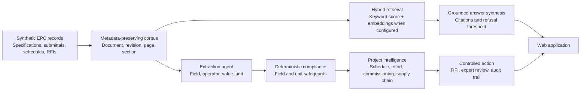

# EPC Guardian Architecture

## System objective

EPC Guardian converts disconnected EPC records into an evidence-backed,
human-controlled decision:

1. retrieve governing requirements and vendor evidence;
2. extract comparable fields, values, units, and conditions;
3. calculate compliance using deterministic rules;
4. connect findings to schedule, cost, commissioning, and logistics;
5. draft corrective action with citations;
6. require a named reviewer and preserve an audit event.

## Logical architecture

## Prototype and scale path

| Layer | Current implementation | Production upgrade |
|---|---|---|
| Interface | Responsive HTML, CSS, and browser JavaScript | React/Next.js and enterprise identity |
| API | Dependency-free Node.js HTTP service | Container service behind an API gateway |
| Evidence | 14 synthetic documents with revision/page metadata | EDMS connectors, object storage, OCR, revision governance |
| Retrieval | Keyword ranking offline; embeddings plus keywords when configured | Persistent vector index, incremental embeddings, reranking |
| Answering | Evidence assembly offline; grounded synthesis when configured | Model routing, prompt versioning, evaluation traces |
| Extraction | Structured AI extraction with local numeric fallback | OCR/layout parsing, schemas, confidence, reviewer correction |
| Compliance | Deterministic operators with field and unit checks | Versioned rules, conversions, ontology, policy engine |
| Schedule | Response-time what-if model across critical findings | P6/MS Project integration and historical calibration |
| Commissioning | Prerequisites, test status, record templates | Approved test packs, signatures, QMS integration |
| Supply chain | Synthetic milestones, variance, severity, alerts | ERP/carrier feeds, geospatial tracking, supplier risk |
| Governance | Human decision API and in-memory audit events | Identity, roles, durable append-only audit history |
| Evaluation | 14 labelled questions and 22 automated tests | Independent expert dataset and continuous monitoring |

## Trust boundaries

- AI retrieves and structures evidence; it does not approve equipment.
- Deterministic code calculates technical compliance.
- Schedule, cost, and effort values expose their assumptions.
- Unsupported questions are refused.
- Contractual action requires a human reviewer.
- The UI identifies configured AI versus offline fallback.

## Demo data flow

1. The specification requires UPS efficiency `>= 96.5%`.
2. The vendor datasheet states `95.2%`.
3. Retrieval returns both sources with page metadata.
4. Extraction identifies the same field and unit.
5. Deterministic code evaluates `95.2 >= 96.5` as false.
6. Schedule logic traces the hold to FAT, dispatch, and energisation.
7. Commissioning logic blocks tests with an open approval prerequisite.
8. Supply-chain logic retains the equipment quality alert.
9. EPC Guardian drafts an RFI and waits for human approval.
